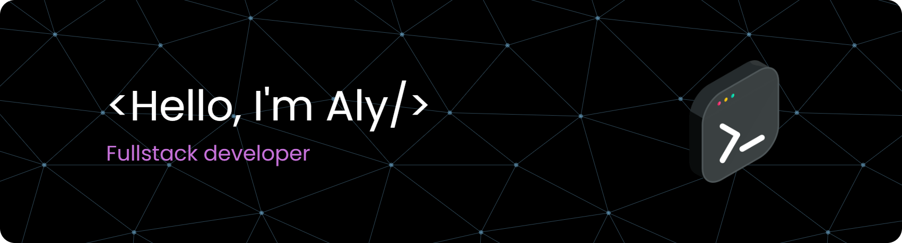

# 💫 About Me:
I'm a Software Engineering student at Universitas Pendidikan Indonesia (UPI) with expertise in web development, graphic design, and digital content creation. Proficient in PHP, SQL, JavaScript, Laravel, React, Node.js, and Adobe Suite, I'm constantly learning new technologies like Docker to stay at the forefront of innovation. Passionate about creating impactful solutions and committed to continuous growth in the tech industry. 
🔭 I’m currently Study in Sofware Engineering University Of Education Indonesia 🌱 I’m currently learning React, Node, and Docker 💬 Ask me about Laravel, React, MySql ⚡ I have business, check it on arahcreative.vercel.app

## 🌐 Socials:

  

## 💻 Tech Stack:

  

                  

## 🏆 GitHub Trophies

### ✍️ Random Dev Quote

